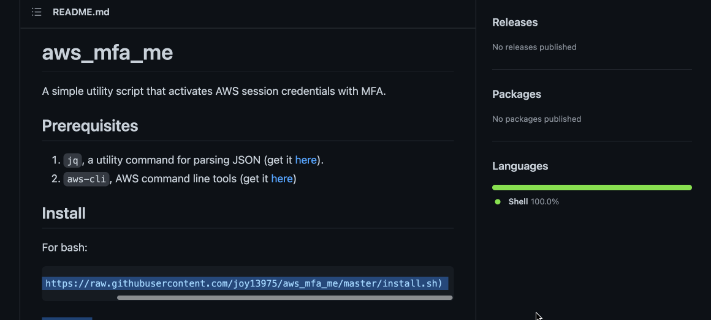

# aws_mfa_me

A simple utility script that activates AWS session credentials with MFA.



## Prerequisites
1. `jq`, a utility command for parsing JSON (get it [here](https://stedolan.github.io/jq/download/)).
1. `aws-cli`, AWS command line tools (get it [here](https://docs.aws.amazon.com/cli/latest/userguide/cli-chap-install.html))

## Install
For bash:
```shell
bash <(curl -s https://raw.githubusercontent.com/joy13975/aws_mfa_me/master/install.sh)
```

## Usage
```shell
source aws_mfa_me
```

You will be prompted for MFA code. You can also replace `source` with `.` as in `. aws_mfa_me`.

You can also pass a MFA code non-interactively:
```shell
echo 123456 | source aws_mfa_me
```

### Options:

Options are set via local scope env vars, without angle brackets:
```shell
duration=<optional: session duration in seconds, default=129600 (36h)> \
mfa_arn=<optional: specific MFA device ARN, default=first in MFA device list> \
    source aws_mfa_me
```
